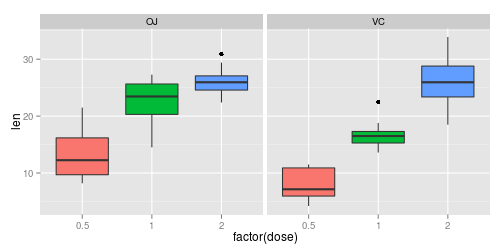
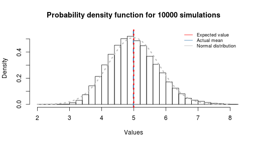
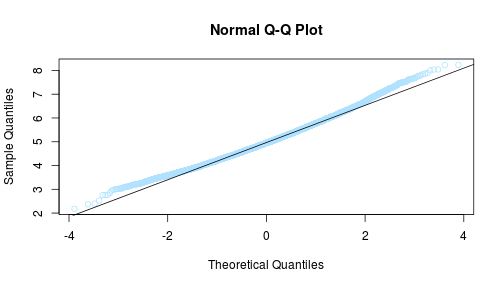
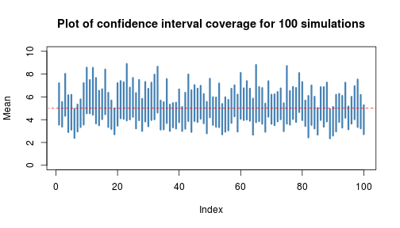

## Statistical Inference - Exponential Distribution

### Introduction
In this project you will investigate the exponential distribution in R and compare it with the Central Limit Theorem. The exponential distribution can be simulated in R with rexp(n, lambda) where lambda is the rate parameter. The mean of exponential distribution is 1/lambda and the standard deviation is also 1/lambda. Set lambda = 0.2 for all of the simulations. You will investigate the distribution of averages of 40 exponentials. Note that you will need to do a thousand simulations.

### Method


The mean and standard deviation of the 40 values were then calculated. The simulations were run 10 times with each mean and standard deviation recorded. These points were plotted on a histogram to show the general distribution. This experiment was then carried out 3 more times such that, in total, results for 10, 100, 1,000, 10,000 simulations were obtained.


```r
set.seed(123)
lambda <- .2; n <- 40
par(mfrow = c(2,2))

for (no_sim in c(10, 100, 1000, 10000)){
  mean_values <- NULL; mean_sds <- NULL
  
  for (i in 1:no_sim){
    values <- rexp(n, lambda)
    means <- mean(values); sds <- sd(values)
    mean_values  <- c(mean_values, means); mean_sds <- c(mean_sds, sds)
  }

  myhist <- hist(mean_values , freq = TRUE, xlim = c(2, 8), 
                 main = paste("Histogram of", no_sim, "simulations"), xlab = "Values")
}
```

 

###Results

The expected value for an exponential distribution is the inverse of its rate parameter (i.e. $\mathbb{E}[X] = 1 / lambda$) which is equal to 5 in this case. The average value for the n = 10,000 simulation was calculated by taking the mean which worked out to be 5.00. As expected, due to the central limit theorem, the expected value of the sample mean is equal to the population mean it's trying to estimate. The distribution of the sample mean is gausian, centered at 5 and concentrated at the center as shown below.


```r
mean(mean_values)
```

```
## [1] 4.992167
```

 

Next, the variance of the sample mean was worked out to be 0.79. This corresponds exactly with the standard error of the mean(i.e. $SE = sigma /\sqrt{n}$) which is equal to 0.79 for the 40 observations. 


```r
sd(mean_values)
```

```
## [1] 0.7825399
```

A Q-Q plot of the mean values was plotted below. There is little deviation between the actual quantile values and the theoretical; this indicates aggregated sample distribution is indeed normal.


```r
qqnorm(mean_values, col = "lightskyblue1")
qqline(mean_values)
```

 

The 95% confidence interval of each simulation was worked out using the interval's own standard deviaton and mean according to the equation $\bar{X} \pm 1.96 sigma/\sqrt{n}$. The coverage was computed as the percent of times the true mean fell within each interval's confidence interval.


```r
upper <- mean_values +  1.96 * (mean_sds/sqrt(n))
lower <- mean_values -  1.96 * (mean_sds/sqrt(n))
sum(lower < 5 & 5 < upper)/10000 * 100
```

```
## [1] 92.59
```

For visualization purposes, the simulation for 100 simulations was rerun and the confidence interval for each simulation was plotted. Here the ~92% coverage is clearly seen.


```r
no_sim <- 100

mean_values <- NULL; mean_sds <- NULL

for (i in 1:no_sim){
  values <- rexp(n, lambda)
  means <- mean(values); sds <- sd(values)
  mean_values  <- c(mean_values, means); mean_sds <- c(mean_sds, sds)
}
upper <- mean_values +  1.96 * (mean_sds/sqrt(n))
lower <- mean_values -  1.96 * (mean_sds/sqrt(n))
sum(lower < 5 & 5 < upper)/10000 * 100
```

```
## [1] 0.97
```

```r
index <- c(1:no_sim)

plot(index, upper, ylim = c(0, 10), type = "n", xlab = "Index", ylab = "Mean", 
     main = "Plot of confidence interval coverage for 100 simulations")

segments(index, upper, index, lower, col = "steelblue", lwd = 3)
#ablineclip(h = 5, col = "red", lwd = 2, lty = 2)
text(-8, 5, expression(paste("", mu, "")), cex = 1.5)
ablineclip(h=5, x1 = -2.5, lty = 2, col="red")
```

 
