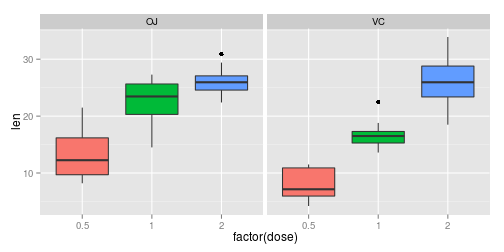

# Analysis of supplements in tooth growth

Now in the second portion of the class, we're going to analyze the ToothGrowth data in the R datasets package


## Introduction
The response is the length of teeth in each of 10 guinea pigs at each of three dose levels of Vitamin C (0.5, 1, and 2 mg) with each of two delivery methods (orange juice or ascorbic acid).

## Data exploration

```r
par(mfrow = c(1,2))
p1 <- ggplot(ToothGrowth, aes(x = factor(dose), y = len, fill = factor(dose))) 
p1 + geom_boxplot() + guides(fill=FALSE) + facet_grid(. ~ supp)
```

 

After plotting the data as boxplots a number of correlations were observed. The length of the tooth increases as the dosage increases. The OJ delivery method yields a greater length than the VC (approximately 10mm) for smaller dosages but the difference is negligable by a 2mg dosage.

# Statistical inference
The tooth growth was compared by supplement for each dosage under the null hypothesis that each supplement has the same effect at a certain dosage on the tooth.

$H_0: \mu_{OJ|0.5} = \mu_{VC_|0.5}$  
$H_0: \mu_{OJ|1.0} = \mu_{VC_|1.0}$  
$H_0: \mu_{OJ|2.0} = \mu_{VC_|2.0}$ 


```r
# split the data up by dosages
d0.5 <- subset(ToothGrowth, dose == 0.5)
d1.0 <- subset(ToothGrowth, dose == 1.0)
d2.0 <- subset(ToothGrowth, dose == 2.0)

# conduct a t-test between supplements
test0.5 <- t.test(len ~ supp, paired = FALSE, var.equal = FALSE, data = d0.5)
test0.5$p.value; test0.5$conf[1]
```

```
## [1] 0.006358607
```

```
## [1] 1.719057
```

```r
test1.0 <- t.test(len ~ supp, paired = FALSE, var.equal = FALSE, data = d1.0)
test1.0$p.value; test1.0$conf[1]
```

```
## [1] 0.001038376
```

```
## [1] 2.802148
```

Dosages 1.0 and 1.5 have significant p-values of 0.006359 and 0.001038 respectively indicating that the difference in mean values between the supplements is significant. Dosage 1.0 has a confidence interval of 1.719-8.781 and dosage 2.0 has a confidence interval of 2.802-9.058. 


```r
test2.0 <- t.test(len ~ supp, paired = FALSE, var.equal = FALSE, data = d2.0)
test2.0$p.value; test2.0$conf[1]
```

```
## [1] 0.9638516
```

```
## [1] -3.79807
```
Dosage 3.0 has a very high p-value of 0.9639 and a confidence interval below zero -3.798-3.638. This indicates that there is no significance between the 
supplements at this dosage. This is also intuitive from the earlier boxplot.

## Conclusions
The supplements orange juice and ascorbic acid have different effects on tooth length for lower dosages of vitamin C according to the t-test. Orange juice yields a longer tooth for dosages of 0.5 and 1.0mg. However at a dosage of 3.0mg there is no change in tooth length.

## Assumptions
- The supplements have a treatment effect and there are no other fconfounding factors.
- Samples are unpaired, with unequal variances.
- Guinea pigs are essentially identical - size, diet etc.
